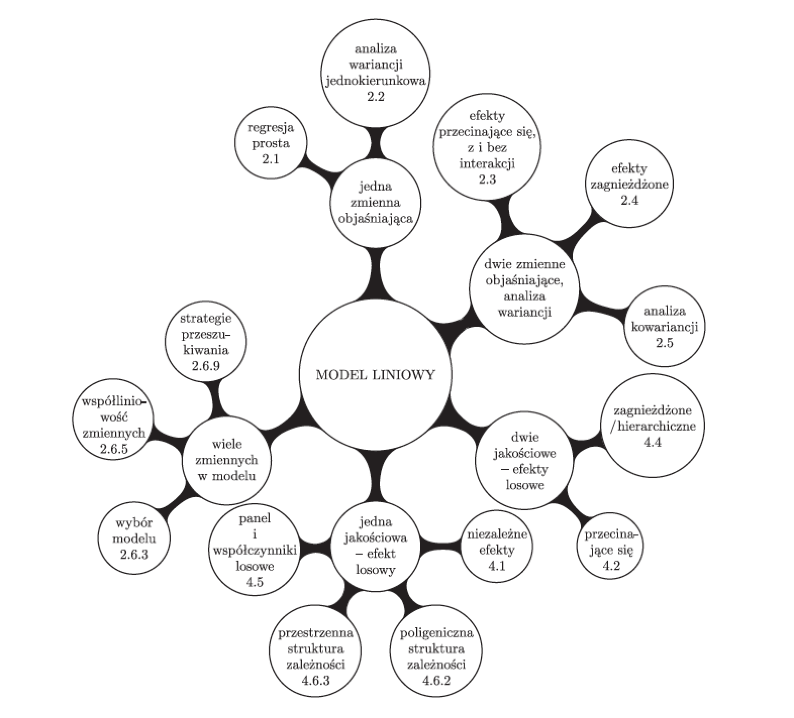
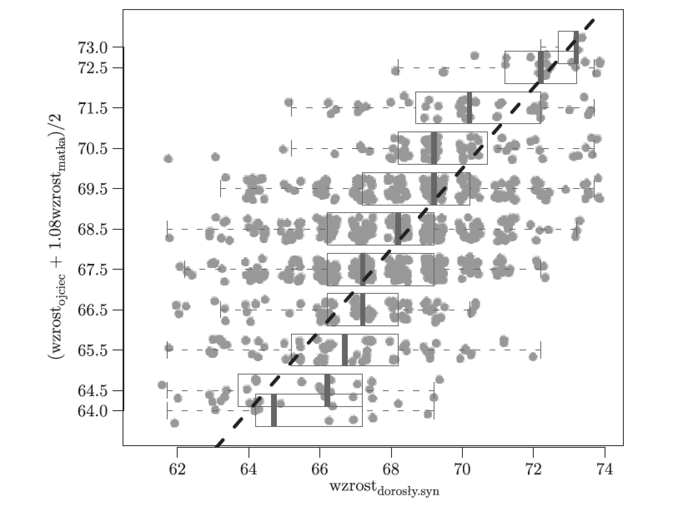
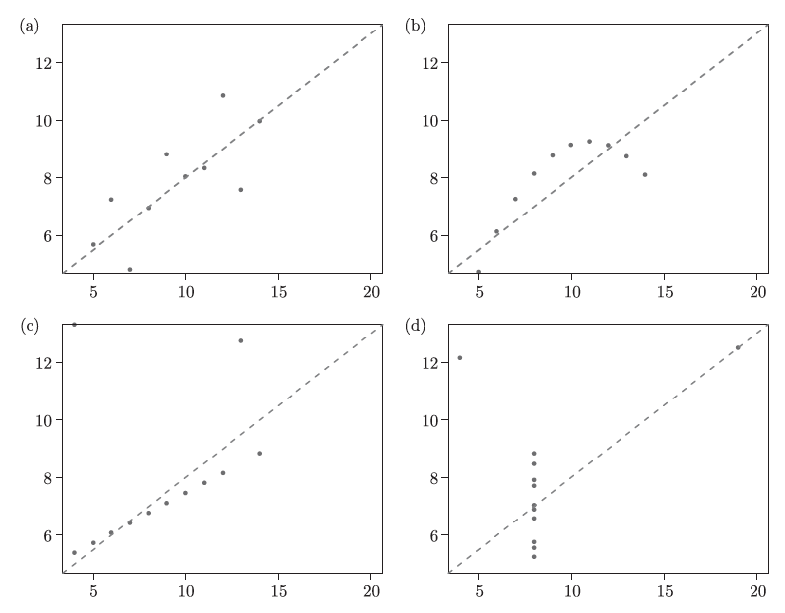

## O kursie

Podczas kursu będziemy poznawać i ćwiczyć rozmaite aspekty modelowania z użyciem modeli liniowych.

Nacisk położymy zarówno na aspekty praktyczne (jak wykonać modelowanie) jak i teoretyczne (dlaczego te metody działają, jak tworzyć nowe). 

Podczas laboratoriów będziemy pracować z programem R.

Materiały na których będizemy pracować pochodza z książki ,,Analiza danych z programem R. Modele liniowe z efektami stałymi, losowymi i mieszanymi'', Przemysław Biecek, Wydawnictwo Naukowe PWN, 2013.
Ksiązka dostępna w naszej bibliotece w postaci papierowej i na serwisie ibuk w postaci elektronicnzej (bezpłatnie przy logowaniu przez UW).

## Zasady zaliczenia

Zaliczenie jest dwuetapowe.

Pierwszy etap oparty jest o punkty.

Po większości wykładów zostanie zadana praca domowa. Poprawne rozwiązanie każdej pracy domowej to 3 punkty. Prace należy wykonywać samodzielnie. 

Podczas kursy będziemy realizować dwa projekty. Projekty realizowane są w grupach od 2 do 4 osób. Każdy projekt składa się z trzech etapów ocenianych odpowiednio na 15, 20 i 25 punktów. Każdy etap jest przedstawiany przez zespół. 

Na bazie punktów z projektów i prac domowych otrzymać można maksymalnie ocenę dobrą.

Osoby, które otrzymają ocenę dobrą mogą napisać dodatkowy sprawdzian weryfikujący również znajomość zagadnień teoretycznych. Jeżeli napiszą ten sprawdzian dobrze, otrzymają ocenę bardzo dobrą.

Zaliczenie jest tak skonstruowane by premiować systematyczną pracę.


## Po co są nam modele liniowe?

Wiele zastosowań, jak chociażby:

* Prognozowanie popytu na energię elektryczną.
* Prognozowanie liczby biletów wykupionych na film.
* Identyfikacja genów związanych z nowotworem.
* Weryfikacja czy lit uszkadza procesy poznawcze.
* Szacowanie efektu szkoły w nauczaniu.
* wiele, wiele innych.

## Jakie modele będziemy omawiać?

<center></center>

## Odrobina historii

Skąd się wzieła nazwa regresja, co to jest midparent oraz czy synowie wyższych rodziców są wyżsi niż śrenia.

<center></center>

## Dane Sir Galtona

```{r, warning=FALSE, message=FALSE}
library(PogromcyDanych)

head(galton)

ggplot(galton, aes(x=rodzic, y=syn)) +
  geom_point() +
  coord_fixed()

ggplot(galton, aes(x=rodzic, y=syn)) +
  geom_jitter() +
  coord_fixed()

ggplot(galton, aes(x=factor(rodzic), y=syn)) +
  geom_boxplot() +
  geom_jitter(alpha=0.5) 

ggplot(galton, aes(x=rodzic, y=syn)) +
  geom_jitter() + 
  geom_smooth(method="lm", formula=y~x) +
  coord_fixed()
```

## Bonus: dane Pearsona

Mniej znany, ale zebrany w podobnym czasie z podobnych pobudek zbiór danych przygotował Karl Pearson. 

```{r, warning=FALSE, message=FALSE}
head(pearson)
```

## Trochę terminologii

<center></center>

## Zróbmy z tego zadanienie optymalizacyjne

Nie nakładamy żadnych założeń co do rozkładu, licząc się z możliwymi przykrymi konsekwencjami.

Metoda najmniejszych kwadratów, minimalizujemy funkcję

$$
RSS = \sum_i(y_i - \hat y_i)^2 =  \sum_i(y - \hat \beta_0 - \hat \beta_1 x_i)^2 
$$

## Model regresji liniowej

```{r, warning=FALSE, message=FALSE}
model <- lm(syn~rodzic, data=galton)
model$coefficients
str(model)
```

## Modele liniowe NIE są symetryczne

```{r, warning=FALSE, message=FALSE}
(wsp1 <- lm(syn~rodzic, data=galton)$coefficients)
(wsp2 <- lm(rodzic~syn, data=galton)$coefficients)
(wsp3 <- c(1/wsp1[2], -wsp1[1]/wsp1[2]))
```

## Było dobrze, ale Francis Anscombe to zepsuł...

```{r, warning=FALSE, message=FALSE}
head(anscombe)

summary(lm(y1~x1,anscombe))$coef
summary(lm(y2~x2,anscombe))$coef
summary(lm(y3~x3,anscombe))$coef
summary(lm(y4~x4,anscombe))$coef
```

## ...to znaczy, pokazał że wcale dobrze nie było

<center></center>


## Jak możemy badać współczynniki regresji?

Wyliczamy p-wartości obliczeniowo.

Jak wyglądałby rozkład współczynników gdyby nie było zależności pomiędzy wzrostem syna a rodzica.

```{r, warning=FALSE, message=FALSE}
N <- 5000
nwsp <- replicate(N, {
  model <- lm(syn~sample(rodzic), data=galton)
  model$coefficients
})
df <- data.frame(intercept = nwsp[1,], slope = nwsp[2,])
par(mfrow=c(1,1))
hist(df$intercept, 100, col="grey")
hist(df$slope, 100, col="grey")
```

Wyliczamy przedziały ufności obliczeniowo.

Zaburzamy model permutując reszty i sprawdzamy co dzieje się ze współczynnikiem. Więcej o tej metodzie [bootstrap resztowy] powiemy w przyszłości.

```{r, warning=FALSE, message=FALSE}
N <- 5000
model <- lm(syn~rodzic, data=galton)
nwsp <- replicate(N, {
  ndf <- data.frame(x = galton$rodzic,
                    y = model$fitted.values + sample(model$residuals))
  model2 <- lm(y~x, data=ndf)
  model2$coefficients
})
df <- data.frame(intercept = nwsp[1,], slope = nwsp[2,])
par(mfrow=c(1,1))
hist(df$intercept, 100, col="grey")
hist(df$slope, 100, col="grey")
```

Wykonujemy graficzną diagnostykę

```{r, warning=FALSE, message=FALSE, fig.width=9, fig.height=12}
par(mfrow=c(3,2))
plot(lm(syn~sample(rodzic), data=galton), which = 1:6)
```

## Praca domowa

1. Na zbiorze danych `heights{PBImisc}` oszacuj zależność liniową pomiędzy wzrostem żony a męża.

2. Wyznacz obliczeniowo przedział ufności dla współczynnika nachylenia.

3. Raport w formacie html z przedziałem ufności wyślij w GitHubie na adres

https://github.com/pbiecek/ModeleLiniowe/tree/master/MIMUW_2015


