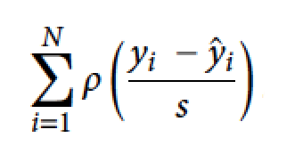
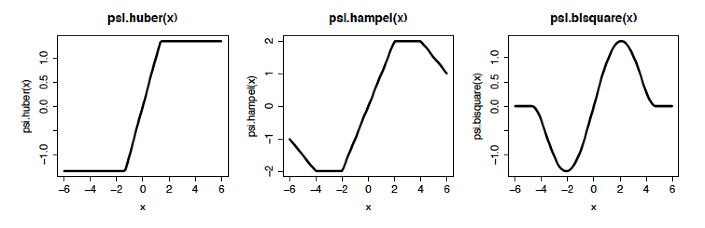
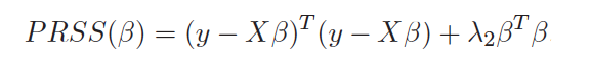
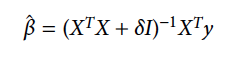
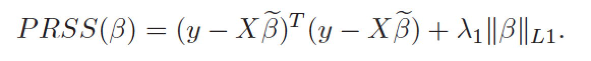
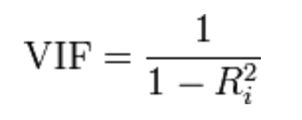

# Beyond BLUE and MLE

BLUE stands for Best Linear Unbiased Estimator.

MLE stands for Maximum Likelihood Estimation.

They are widely used and for Gaussian model they give same estimates for beta coefficients. 
But, in some cases it is worth to consider different estimators.

## Robust regression

When minimizing RSS criteria the loss function is quadratic. Therefore outliers are very influential.

If we suspect that there are some outliers, what can we do, how we can deal with them?

Instead of using quadratic loss function we may be more tolerant. Let's modify the minimalized function. The new function to be minimizes is



There are many ways how to select the $\rho$ function (or it's derivative called $\psi$). The most popular choices are: Huber, Hampel and Tukey bisquare.



Let's see how to use robust regression.

First, let's generate an artificial data set with a single outlier.

```{r, fig.height=5, fig.width=5}
library(ggplot2)
library(MASS)
x <- seq(0,10,0.3)
y <- x + rnorm(length(x))
df <- data.frame(x=c(-5, x),y=c(15, y))
ggplot(df, aes(x, y)) + geom_point() 
```

What shall we expect?

```{r, fig.height=5, fig.width=5}
ggplot(df, aes(x, y)) + geom_point() + 
  geom_smooth(method="lm", se=FALSE) + 
  geom_smooth(method="rlm", se=FALSE, color="red") 
```

So, how to use robust linear models (rlm implemented in MASS)?

```{r}
lm(y~x, data=df)
rlm(y~x, data=df, psi = psi.huber, k=1)
```


## Regularized regression

BLUE stands for Best Linear Unbiased Estimator. Having only unbiased estimators the best one is the one with lowest variation. 

But sometimes one can reduce the mean square error by adding a bias in order to reduce variance of the estimator (see chapter 1.6 in ,,Analiza danych z programem R'' for more details). 

Let us consider following penalizes sum of squares



For this penalty one can find a formula for beta.



Note what is happening with the matrix $X^TX$. By adding some constant to the diagonal we make it easier to invert whole matrix.

So, how this is working?

Let's see an artificial example with very very strange behaviour.

What is your guess for coefficients for the dataset simulated below?

```{r}
set.seed(1313)

x <- rnorm(100)
z <- x + rnorm(100)/10^3
y <- x+z  + rnorm(100)
df <- data.frame(x,y,z)

lm(y~x+z, data=df)
```

Not good.

Ridge regression will stabilize estimates.

```{r}
lm.ridge(y~x+z, data=df, lambda=1)
```

But how to choose `lambda`? 

Too small is bad, too large is even worse.

```{r, fig.height=5, fig.width=5}
lambdas <- 2^((-20):20)
coefs <- sapply(lambdas, function(lambda) {
  lm.ridge(y~x+z, data=df, lambda=lambda)$coef
})
df2 <- data.frame(t(coefs), lambdas)
head(df2)

ggplot(df2, aes(lambdas, x)) +
  geom_line(color="green3") + ylab("coefficients") +
  geom_line(aes(lambdas, z)) + scale_x_log10()
```

## LASSO

LASSO stands for Least Absolute Shrinkage and Selection Operator.

People are introducing different penalties. For some we can observe a very interesting behaviour of estimates.



There is a dual representation of this problem that imposes constraints over estimates. Due to property of L1 penalty some coefficients will be reduced to 0.

In order to illustrate this we will start with model with four unstable estimates.

```{r}
x <- rnorm(1000)
x1 <- x + rnorm(1000)/10^3
x2 <- x + rnorm(1000)/10^3
x3 <- x + rnorm(1000)/10^3
y <- x + x1 + x2 + x3  + rnorm(1000)
df <- data.frame(x,y,x1, x2, x3)

lm(y~., data=df)
```

So, let's see what will happen if we impose additional constraints over estimates of coefficients.

```{r, warning=FALSE, message=FALSE}
library(lasso2)
l1ce(y~., data=df, bound=10, absolute.t=TRUE)$coef
```

What will happen for different constraints?

See, the coefficients are reduced to zero one by one.

```{r, warning=FALSE, message=FALSE, fig.width=5, fig.height=5}
lambdas <- 10^seq(-1,3,0.1)
coefs <- sapply(lambdas, function(lambda) {
  l1ce(y~., data=df, bound=lambda, absolute.t=TRUE)$coef
})
df2 <- data.frame(t(coefs), lambdas)

ggplot(df2, aes(lambdas, x)) +
  geom_line(color="green3") + ylab("coefficients") +
  geom_line(aes(lambdas, x1), color="red3") + 
  geom_line(aes(lambdas, x2), color="blue3") + 
  geom_line(aes(lambdas, x3)) + 
  scale_x_log10()
```

## Take home message

1. Consider robust regression to deal with outliers
2. Consider ridge regression to deal with correlated predictors
3. Consider LASSO regression to filter out some variables.

# Model selection - a Drosophila study

Quantitative Trait Locus (QTL) mapping is a study in which researchers identify loci linked with some quantitative trait. It is (was?) widely used to produce more efficient plants and various animals (tougher egg shells, cows that produce more milk, pigs that give more meat and so on).

Here, let's consider a Drosophila (fruit fly) study with 41 loci and a single quantitative trait (shape of proboscis).

First 41 variables are genotypes for selected loci, last 5 are phenotypes.

```{r, message=FALSE, warning=FALSE}
library(PBImisc)
attach(Drosophila)
head(bs)
chr
pos
```

Due to the mechanism of gene inheritance loci that are close are more similar/correlated.

```{r, warning=FALSE, message=FALSE, fig.width=5, fig.height=5}
korr = cor(bs[,1:42])
korr[1:6,1:6]

heatmap(1-abs(korr),symm=T,Rowv=NA,Colv=NA)
```

## Variance inflation factor

The correlation of dependent variables may be detected with VIF factor.



We know that correlated predictors cause problems.

```{r}
library(car)
vif(lm(pc1~., data=bs[,1:42]))
```

Having correlated variables it is risky to put all of them into a model.

What we can do? Let's add one variable by one and let's illustrate what is happening.

First, we are performing one-dimensional search. For each loci/gene we consider a separate ANOVA model. Then we plot p-values for each variable as a function of gene location. Last, we check the name of 'most significant' gene.

```{r, warning=FALSE, message=FALSE, fig.width=7, fig.height=5}
library(lattice)
pval = numeric(41)
for (i in 1:41) {
   pval[i] = summary(aov(bs$pc1 ~ bs[,i]))[[1]][1,5]
}
xyplot(-log(pval)~pos|chr, type=c("p","l"), pch=19)

colnames(bs)[which.min(pval)]
```

We have selected the first variable. Now it is time to find the second one.

Let's performed a next one-dimensional search but for models with two variables, the 'best variable' in the model plus the candidate one. 

What will happen with p-values?

```{r, warning=FALSE, message=FALSE, fig.width=7, fig.height=5}
pval2 = numeric(41)
for (i in 1:41) {
   pval2[i] = summary(aov(bs$pc1 ~ bs$fas+bs[,i]))[[1]][2,5]
}
xyplot(-log(pval)+-log(pval2)~pos|chr, type=c("p","l"), pch=19)
colnames(bs)[which.min(pval2)]
```

We can repeat these steps further. 

By adding new variables one by one we can find a set of important variables. Note that effects of some variables are explained by neighbours due to high correlation of predictors.

```{r, warning=FALSE, message=FALSE, fig.width=7, fig.height=5}
pval3 = numeric(41)
for (i in 1:41) {
   pval3[i] = summary(aov(bs$pc1 ~ bs$fas+bs$mlc+bs[,i]))[[1]][3,5]
}
xyplot(-log(pval)+-log(pval2)+-log(pval3)~pos|chr, type=c("p","l"), pch=19)
colnames(bs)[which.min(pval2)]

```


# Home work for 26 XI 2015

For the Drosophila study check what will happen with coefficients if:

a) all variables are included into a model and standard MLE estimates are calculated,
b) ridge regression is applied,
c) lasso regression is applied.

For points b) and c) present how model coefficient behaves as a function of penalty/parameter.

