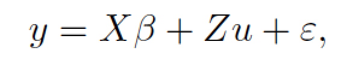
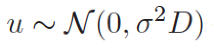
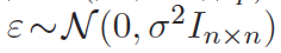

Today we are going to consider a model with single random effects (mixed effects = random effects + fixed effects).






Again, it will be a deep dive.

Next week we will talk about formal definition of the model.

# Single categorical variable

As a warmer we are going to use a 'milk' dataset. 

Ten cows, four measurements for each cow. 

And the question: what is the average production of milk per cow.

```{r, warning=FALSE, message=FALSE}
library(PBImisc)
head(milk)

library(lattice)
dotplot(cow~milk.amount, data=milk, xlab="milk production [kg/day]")
```

One may think that the question about average milk production is an easy one.

```{r, warning=FALSE, message=FALSE}
(srednie = with(milk, tapply(milk.amount, cow, mean)))

summary(model2 <- lm(milk.amount~cow, data=milk))
```

But some people like more complex models.

```{r, warning=FALSE, message=FALSE}
library(lme4)
(model1 <- lmer(milk.amount~(1|cow), data=milk))
(model3 <- lmer(milk.amount~(1|cow), data=milk, REML=FALSE))
```

Let's compare predicted average milk production per cow.

```{r, warning=FALSE, message=FALSE}
ocenaMR = unlist(ranef(model1)) + fixef(model1)
ocenaMM = unlist(ranef(model3)) + fixef(model3)
ocenaLM = c(0,model2$coef[-1]) + model2$coef[1]
cbind(srednie, ocenaLM, ocenaMR, ocenaMM)
```

# Two categorical variables

Let's consider a bit more complicated case (this time, real data set).

In the dataset you will find 1000 measurements for 465 cows. Cows have different genotypes. Here we observe genotype for gene btn3a1.
We would like to check if there is any relation between genotype of btn3a1 and phenotype (amount of milk).

```{r, warning=FALSE, message=FALSE}
summary(milkgene)
bwplot(milk~lactation, data=milkgene, ylab="milk production [kg/day]")
```

## Now, your turn.

Build a classical ANOVA model with two or three effects (cow, lactation, btn3a1) that will assess the importance of btn3a1.

## Let's back to mixed effects

Here cow.id is threated as a random effect.

```{r, warning=FALSE, message=FALSE}
(model1 <- lmer(milk~btn3a1+lactation+(1|cow.id), data=milkgene))
```

One can extract and plot predictions for random effects.

```{r, warning=FALSE, message=FALSE, fig.width=7, fig.height=10}
u = ranef(model1, condVar =TRUE)
dotplot(u)
```

# Tests for coefficients

## Standard Wald test

```{r, warning=FALSE, message=FALSE}
summary(model1)$coef

tse = summary(model1)$coef[2,3]
2*pnorm(tse, lower.tail=T)
```

## Likelihood ratio test

```{r, warning=FALSE, message=FALSE}
modelWithBTN1 = lmer(milk~btn3a1+lactation+(1|cow.id), data=milkgene, REML=F)
modelWithoutBTN1 = update(modelWithBTN1, . ~ . -btn3a1)

logLik(modelWithBTN1)
logLik(modelWithoutBTN1)

anova(modelWithBTN1, modelWithoutBTN1)
```

## Permutation test

```{r, warning=FALSE, message=FALSE}
N = 1000
logs = replicate(N, logLik(lmer(milk~sample(btn3a1)+lactation+(1|cow.id), data=milkgene, REML=FALSE)))
mean(logs > logLik(modelWithBTN1))
```

## Likelihood ratio test for random effect

```{r, warning=FALSE, message=FALSE}
(fullModel <- logLik(model1<-lmer(milk~btn3a1+lactation+(1|cow.id), data=milkgene)))
(modelWithoutCow <- logLik(model2<-lm(milk~btn3a1+lactation, data=milkgene)))
(lDelta = as.numeric(modelWithoutCow - fullModel))
pchisq(- 2 * lDelta, 1, lower.tail=FALSE)
pchisq(- 2 * lDelta, 409, lower.tail=FALSE)
```

## Permutation test for random effect

```{r, warning=FALSE, message=FALSE}
milkgene2 = milkgene
N = 1000
logs = replicate(N, {
 milkgene2$cow.id = sample(milkgene2$cow.id);
 logLik(lmer(milk~btn3a1+lactation+(1|cow.id), data=milkgene2))})
mean(logs > logLik(model1))

```


# Home work for 3 XII 2015

Read sections 3.1-3.6 from ,,Analiza danych z programem R, Modele liniowe mieszane'' or in English chapter 1 from ,,lme4: Mixed-effects modeling with R'' http://lme4.r-forge.r-project.org/lMMwR/lrgprt.pdf 

We will talk about this theory. It's not easy and it is better to be prepared.

