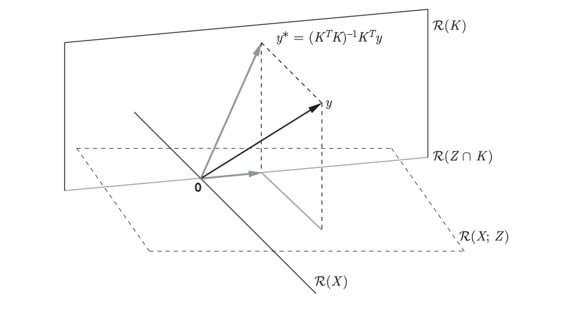
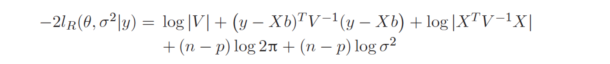
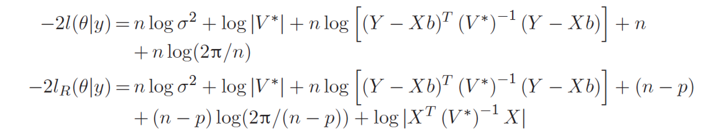
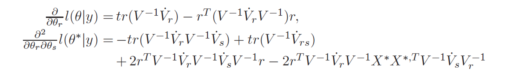
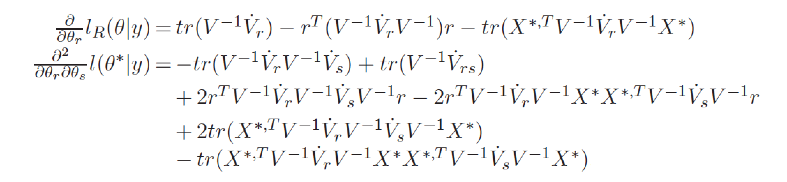
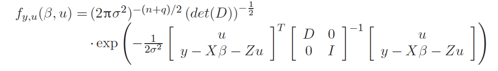
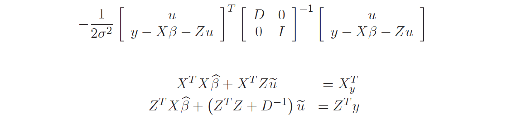

# Model formulation

Let's recall the formulation of mixed effects, mixed i.e. with random effects and fixed effects.

$\varepsilon$ and $u$ stands for random values from Gaussian distribution with variance matrices $I$ and $D$ respectively.

Now we can write the marginal and conditional distribution for y.

# Estimation

How to estimate model parameters? Let's start with the Maximum Likelihood approach.

Here is the likelihood function.

It will be much easier to work with log likelihood. To get rid off some constants we will work with -2 log likelihoods.

## Profiling

How many parameters do we have in this model?

Since we are going to estimate these parameters with the use of iterative algorithms it is much better to reduce parameter space.

And we can remove a lot of degrees of freedom from the formula by profiling $\beta$.

Just notice, that for known $V$ one can estimate $\beta$ from formula for weighted least squares.

Also, let's extract $\sigma^2$ from $V$, now we can write down likelihood for two parameters.

Here let's stop for a while. We've reduced number of dimensions for parameter search, but still they are confounding parameters in our estimation. 

This is why sometimes people consider restricted maximum likelihood (REML). 

What's the idea behind REML? 

We will get rid of beta parameters by projection of original space on the space orthogonal to X (space without $\beta$).

So here we have model formulation without $\beta$

So we can write the log likelihood for this model as well

## More profiling

It turns out that we can profile $\sigma^2$ as well (here $V^*$ is $V/\sigma^2$)

Since we can separate $V^2$ and $\sigma^2$ one can just calculate derivative over $\sigma^2$ and get

After all this profiling it is enough just to estimate $\theta$ parameter in $V$. And we get likelihood for $\theta$

## Newton Raphson

So, how to estimate $\theta$? 

We can use Newton Raphson algorithm,

just need to calculate first and second derivative over $\theta$.

In general these derivatives are rather long....

For ML

For REML

So in general form it's rather complicated. 

But usually, most of considered models have quite straightforward matrix $D$

and the matrix $V$ is reduced to

## Henderson equation

We said that $u$ are random values, but sometimes it is good to have some numbers for them. We will not use word `estimation` since it refers to fixed parameters, instead of it we will use `predictions`.

So how to calculate predictions for $u$?

Charles Hnderson proposed to start with likelihood for all fixed and random parameters $(\beta, u)$.

Minimization with respect to $u$ and $\beta$ is equivalent to minimization of

So finally we get the Henderson equation

# Distribution for $\beta$ and $u$

And from the formula above we can get variance - covariance matrix or $\beta$ and $u$

# How to test model parameters?

In order to test significance of model parameters one can choose

- Wald test (for n >> p), i.e. $\hat\beta/se(\hat\beta)$ which is approximately $N(0,1)$,
- Likelihood ratio test, here the test statistic is approximately distribution chi-square
- permutational tests (more computationally depending but not based on asymptotical properties).

# Home work for 10 XII 2015

There is a problem with theoretical formulation of distribution for $\hat\theta$.

But one can use simulations to study this distribution in controlled settings.

The task: simulate distribution of $\hat\theta=\hat\sigma^2_1$ when the true $\sigma^2_1=0$ (all random effects are equal 0) and when $\sigma^2_1=1$.

To simulate distribution of $\hat\sigma^2_1$ one should repeat many times (i.e. 1000) following scenario

- simulate $\varepsilon$ and $u$ from Gaussian distribution with given $\sigma^2_0$ and $\sigma^2_1$,
- estimate $\hat\sigma^2_1$ with the use of `lme4`.

