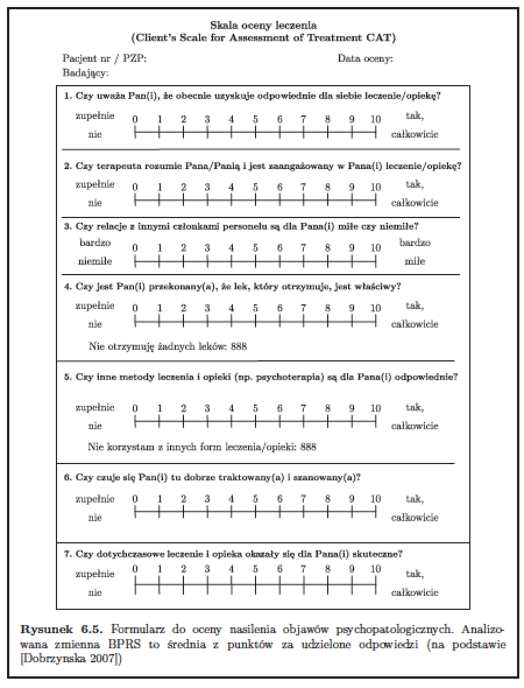
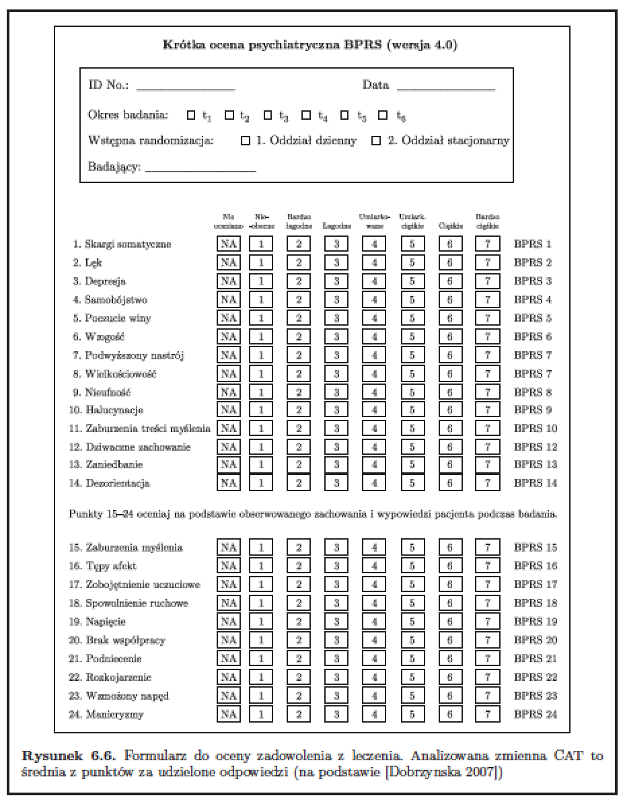

# One variance component

## The `corn` dataset

Let's start with a bit more complex model for gene expression in corn.

### The question

We are interested in an effect of a temperature (cold/control) on different corn lines. For each line we have 4 measurements (called technical replicates) for three different plants.

```{r, message=FALSE, warning=FALSE}
library(PBImisc)
corn[1:3,1:7]
# DH.C.1 DH.C.1 DH.C.1 DH.C.2 DH.C.2 DH.C.2 DH.C.3
# MZ00056801 12.203489 8.769006 6.846193 5.369957 7.355085 6.431522 5.998226
# MZ00056807 6.133096 9.637903 6.772756 4.433962 7.644376 9.234691 6.629690
# MZ00056825 7.244813 6.984742 7.930812 5.531837 7.258159 8.389686 8.040021
```

Let's see the model for a single gene

```{r}
# We will convert column names into three dependent variables
cnames = colnames(corn)
X = t(matrix(unlist(strsplit(cnames, ".", fixed=T)), 3, 36))
X = data.frame(X)
colnames(X) = c("species", "temperature", "plant")

summary(X)
```

Now, select data for a single gene and do the modelling.

```{r, warning=FALSE, message=FALSE}
y = corn[4613,]

library(lattice)
bwplot(y~species:temperature, data=X)
# let's see what are the averages in each group
by(y, X$species:X$temperature, mean)
```

So, how to fixed and mixed models may look like?

### Three models, three sets of estimates

```{r}
model1 = lmer(y~species*temperature + (1|plant:species:temperature), data=X)
summary(model1)$coefficients

modelM = lmer(y~species*temperature + (1|plant:species:temperature), data=X, contrasts = list(species="contr.sum", temperature="contr.sum"))
printCoefmat(summary(modelM)$coef[1:4,])

modelL = lm(y~species*temperature + plant:species:temperature, data=X, contrasts = list(species="contr.sum", temperature="contr.sum"))
printCoefmat(summary(modelL)$coef)
```

### Tests for each gene

Let's calculate these models for all genes

```{r, cache=TRUE, warning=FALSE, message=FALSE}
N = nrow(corn)
# p-values for fixed effects will be stored in mat matrix
mat_random = matrix(0, N, 3)
mat_fixed = matrix(0, N, 3)
# variance components will be stored in the matrix war
war = numeric(N)
for (i in 1:N) {
 y = corn[i,]
 model = lmer(y~species*temperature + (1|plant:species:temperature), data=X, contrasts = list(species="contr.sum", temperature="contr.sum"))
 mat_random[i,] = summary(model)$coef[2:4,3]
 war[i] = var(ranef(model)[[1]])
 
 modelL = lm(y~species*temperature + plant:species:temperature, data=X, contrasts = list(species="contr.sum", temperature="contr.sum"))
 mat_fixed[i,] = summary(modelL)$coef[2:4,3]
}
head(mat_random)
head(mat_fixed)
```

How to summarise results?

We may use Venn Diagrams to summarise the overlap of effects.

```{r, cache=TRUE}
alpha = 0.001
(c = -qnorm(alpha/2))
tmp = as.data.frame(abs(mat) > c)
colnames(tmp) = c("species","temperature","interaction")
tmp2 = as.data.frame(abs(mat2) > c)
colnames(tmp2) = c("species","temperature","interaction")
library(gplots)
venn(tmp)
venn(tmp2)
```

Models with only fixed effects produce more significant effects. Is it because of higher variation of estimates?

Models with random effects produce smaller number of significant effects. But here the overlap is larger – it is an additional validation.

# Two variance components

## The EUNOMIA study 

Let's consider the study EUNOMIA: European Evaluation of Coercion in Psychiatry and Harmonisation of Best Clinical Practise

* BPRS - Average score for Brief Psychiatric Rating Scale, measured in times: T1, T2 and T3
* CAT - Clients Scale for Assessment of Treatment, short assessment, which measures the impact of COPD on a patients life, measured in times: T1, T2 and T3
* MANSA.T1, MANSA.T2, MANSA.T3 - Scale which measures Quality of Life (Manchester Short Assessment of Quality of Life), measured in times: T1, T2 and T3
* ICD10 - International Statistical Classification of Diseases and Related Health Problems 10th Revision (ICD-10)





What data we are going to work with?

```{r}
library(PBImisc)
summary(eunomia[,c(1:5,9:11,15)])
```

### The Question 

Is there a relation between number of psychiatric symptoms and number of hospitalisations?

Let's start with a simple model

```{r}
library(lattice)
xyplot(BPRS.T2 ~ NUM.HOSP, eunomia, type = c("g","p","r"), pch=19)
```

What about classical fixed effects?

```{r}
summary(lm(BPRS.T2 ~ NUM.HOSP, eunomia))
summary(lm(BPRS.T2 ~ NUM.HOSP+AGE+GENDER, eunomia))
```

### More factors

Let's take into account two additional factors. One is the centre while second - the diagnosis.

How to model them?

```{r}
bwplot(CENTRE13~BPRS.T2, data=eunomia)

eunomia$ICD103 <- factor(substr(eunomia$ICD10,1,3))
eunomia$ICD103 <- reorder(eunomia$ICD103, eunomia$BPRS.T2, mean)
bwplot(ICD103~BPRS.T2, data=eunomia)
```

How the relation between NUM.HOSP and BPRS looks in different centres?

```{r}
xyplot(BPRS.T2 ~ NUM.HOSP | CENTRE13, eunomia, type = c("g","p","r"), index = function(x,y) coef(lm(y ~ x))[1])
```

### Modelling

So, how to build the model?

If effects of CENTER and ICD10 are constant (no random coefficients).

```{r}
library(lme4)
lmer(BPRS.T2~NUM.HOSP + (1|CENTRE13) + (1|ICD10), data=eunomia)

# Wald test
# H_0: mu = 0
# (Intercep) = 26.37
2*pnorm(26.37, lower.tail=FALSE)
# H_0: beta_NUM.HOSP = 0
# (NUM.HOSP) = 19.29
2*pnorm(19.29, lower.tail=FALSE)
```

### ML tests

Let's start with models without and with a particular variable.

```{r}
modelFull = lmer(BPRS.T2~NUM.HOSP + (1|CENTRE13) + (1|ICD10), data= eunomia, REML=F)
modelwithoutINT = update(modelFull, . ~ . -1)
modelwithoutNUM = update(modelFull, . ~ . -NUM.HOSP)
```

Likelihood functions for these models are

```{r}
logLik(modelFull)
logLik(modelwithoutINT)
logLik(modelwithoutNUM)
```

Now, we can calculate p-values for ML ratio tests.

```{r}
anova(modelFull, modelwithoutINT)
anova(modelFull, modelwithoutNUM)
```

### Permutations

And alternative attempt, the permutation test.

```{r}
N = 99
logs = replicate(N,
 logLik(lmer(BPRS.T2~sample(NUM.HOSP) + (1|CENTRE13) + (1|ICD10),
data=eunomia, REML=F)))
(sum(logs > logLik(modelFull))+1)/(N+1)
```

### ML test for random components

What about test for whole random component?

With ML ratio test we can test any number of parameters.

```{r}
logLik(model1<-lmer(BPRS.T2~NUM.HOSP + (1|CENTRE13) + (1|ICD10), data= eunomia))
logLik(model2<-update(model1, . ~ . -(1|CENTRE13)))
logLik(model3<-update(model1, . ~ . -(1|ICD10)))

# without both random components
logLik(model4 <- lm(BPRS.T2~NUM.HOSP, data=eunomia))
# with ICD10 and CENTER effects included as a fixed effects
logLik(model5 <- lm(BPRS.T2~NUM.HOSP+ICD10+CENTRE13, data=eunomia))

anova(model1, model2)
anova(model1, model3)
```

### Permutations

In similar way we can perform permutation tests for random components. 

Note, that here p-value cannot be smaller than 0.001.

```{r}
N = 999
eunomia2 = eunomia
logs = replicate(N, {
 eunomia2$ICD10 = sample(eunomia2$ICD10)
 logLik(lmer(BPRS.T2~NUM.HOSP + (1|CENTRE13) + (1|ICD10), data=eunomia2, REML=F))
 })

(sum(logs > logLik(modelFull))+1)/(N+1)
```


```{r, echo=FALSE, eval=FALSE}
groupDisp(BPRS.T2~NUM.HOSP + (1|CENTRE13) + (1|ICD10), data=eunomia, var="CENTRE13")
groupDisp(BPRS.T2~NUM.HOSP + (1|CENTRE13) + (1|ICD10), data=eunomia, var="ICD10")

obsDisp(BPRS.T2~NUM.HOSP + (1|CENTRE13) + (1|ICD10), data=eunomia, which=1:20)

tmp <- ranef(model1, postVar=TRUE)
# qq-plot with intervals
qqmath(tmp)$ICD10
# variance-covariance matrix
str(tmp)
```

## The `dementia` study

Let us consider a model with random coefficients, a result of meta analysis. It will be based on a following set of studies.


### The question

We are using MMSE (mini-mental) score to assess the level of dementia as a function of age and gender. 

```{r}
head(dementia)
summary(dementia)
```

We know that different studies (different locations) have different populations, and the link between age and dementia or gender and dementia may be different.

### ML ratio test

Let's start with three different models. Can you explain what is different between them?

```{r}
model0 <- lmer(demscore~age*sex+(1|study), data=dementia, REML=F)

modelFullI <- lmer(demscore~age*sex+(age*sex|study), data=dementia, REML=F)
summary(modelFullI)

modelFullII <- lmer(demscore~age+sex+(age+sex|study), data=dementia, REML=F)
anova(modelFullI, modelFullII)
```


```{r}
modelFullIIbs <- lmer(demscore~age+sex+(age|study), data=dementia, REML=F)
modelFullIIba <- lmer(demscore~age+sex+(sex|study), data=dementia, REML=F)
anova(modelFullII, modelFullIIbs)
```


```{r}
anova(modelFullII, modelFullIIba)
```

# The homework [17 XII]

For the `eunomia` study perform following analyses:

* Try a post-hoc test for effect of `ICD10` to find out which diseases are more likely to produce psychotic behaviours?
* Is it possible you cluster `ICD10` groups depending on average level of psychotic behaviours?
* Is it possible to do something similar if `ICD10` is coded as random effects?


