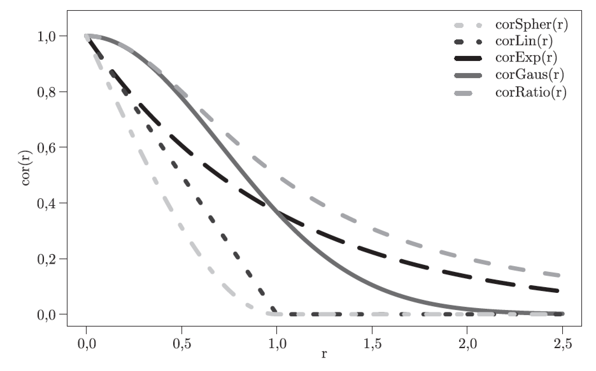

# Apartments

Today we are going to work with data about apartment prices. The data was downloaded from the website `http://www.oferty.net/`. It covers offers for apartments in Warsaw during the period 2007-2009.

So first, let's familiarise with the data,

```{r, message=FALSE, warning=FALSE}
library(lme4)
library(PBImisc)
library(ggplot2)

head(apartments <- na.omit(apartments[,c(1,5,9, 13,15,16)]))
```

# Segmented regression

What is the relation between construction date and the price per square meter?

```{r, message=FALSE, warning=FALSE}
ggplot(apartments, aes(construction.date, m2.price)) +
  geom_point() +
  geom_smooth(se=FALSE, color="red", size=2)
```

So, first, is this relation a surprise? Why it's not monotonic?

.

.

.

Second, how to model such relation?

Up to now we were using linear relations or small order polynomials. But this relation does not look like a polynomial of small order.

Any suggestions? What we can do with such relations?

.

.

.

One possible solution is the segmented regression. The idea behind is that in different intervals the relation is modelled as a linear one.  So it is a so called piecewise linear relation.

For a second, let's assume that the change point for the relation is in 1990. In order to model a relation with two linear curves that are crossed in the year 1990 you need to specify three parameters (four parameters minus one constraint = tree parameters).

There are many possible parameterisations, let's work with one of them.

```{r, message=FALSE, warning=FALSE}
apartments$construction1990 = apartments$construction.date - 1990
apartments$olderThan1990 = apartments$construction.date > 1990

model <- lm(m2.price ~ construction1990:olderThan1990, data=apartments)

model <- lm(m2.price ~ construction1990+construction1990:olderThan1990, data=apartments)

ggplot(apartments, aes(construction1990, m2.price-7150, group=olderThan1990)) +
  geom_point() +
  geom_smooth(se=FALSE, color="red", size=2, method="lm", formula=y~x-1)
```

Questions for you.

1. How to verify if there are two segments? How to check that the model with two segments is better than a model with just simple linear fit?

2. How to find 'an optimal' change point? What criteria would you use?

.

.

.


# Spatial data

A second interesting variable here is the district. Is there a difference in apartment prices between districts? For sure. But we do not have enough data for each district to include it as a separate effect. We need to look for some other solutions.

A plausible assumption is that the price will be related with the distance to down town (the closer the higher).

To test this hypothesis first, let's convert geographical coordinates into kilometres.

```{r, message=FALSE, warning=FALSE}
# This function calculates distance between two points.
# It's an approximation but quite accurate within Warsaw
getDistKm <- function(x, y) {
 sqrt(sum(((x-y)*c(100,70))^2))
}

# where is the down town?
head(apartmentsInDownTown <- which(apartments$district == "Srodmiescie"))
(downTownCoords = apartments[apartmentsInDownTown[1],5:6])

# how far is the city centre?
# for each district, how far it is from down town
districts <- levels(apartments$district)
distances <- sapply(districts, function(x)
  getDistKm(downTownCoords, apartments[apartments$district == x, 5:6][1,]))

head(distances)
```

Now, in order to verify if there is any relation between distance and price, one can plot the relation 


```{r, message=FALSE, warning=FALSE}
boxplot(m2.price~district, data=apartments, at=distances, varwidth=TRUE, bty="n", las=2, xlim=c(0,16))
axis(3); mtext("Distance from DownTown [km]", line=2)

boxplot(m2.price~district, data=apartments, at=distances, varwidth=TRUE, bty="n", las=2, xlim=c(0,16), ylim=c(6000,14000))
axis(3); mtext("Distance from DownTown [km]", line=2)
```

So, how to check the significance of this relation?

We can include the distance as a dependent variable.

```{r, message=FALSE, warning=FALSE}
# add information about distances to data frame
apartments$distances = distances[apartments$district]
# add this variable to the model
summary(model2 <- update(model, .~. + distances))
```

This is one approach. But is it good one? 

.

.

.

Can you find some bottlenecks?

.

.

.

Is the relation only about the distance from down town?

What about the Vistula river? Maybe the distance in the East-West direction is more important than in the North-South direction?

We need more tools to verify such hypotheses and further investigate such relations.


.

.

.


One of such tools is the variogram.

So one question is, if observations that are closer to each other, are more similar/share some covariance? So what is the covariance as a function of distance?

A tool for measure such relation is called the variogram.


And the natural estimator for it is (for observations on a regular grid).


If observations are not on regular grid, then the covariance is usually smoothed.

Let's see two example variograms. First will consider only distance on East-West direction, the second in both directions.

```{r, message=FALSE, warning=FALSE}
avg.m2.price = tapply(apartments$m2.price, apartments$district, mean) / 1000
lon <- tapply(apartments$lon, apartments$district, mean) * 70
lat <- tapply(apartments$lat, apartments$district, mean) * 100
districts.aggr = data.frame(avg.m2.price, lon, lat)
# the Variogram() function calculates a variogram
library(nlme)
plot(Variogram(districts.aggr$avg.m2.price, dist(districts.aggr$lon)),
  xlab="Distance East-West [km]", span=0.4)
plot(Variogram(districts.aggr$avg.m2.price, dist(districts.aggr[,2:3])),
  xlab="Distance [km]", span=0.4)
```

[Variograms in other packages](http://www.ats.ucla.edu/stat/r/faq/variogram.htm)

Could you explain what is happening on really small or really large distances?

.

.

.

Ok, plots are nice, but what about tests?

The Mantel test verifies if there is a significant correlation between two distance matrices.

As a test statistic the Pearson correlation coefficient is used. Then the distribution of the test statistic is derived with permutations.

```{r, message=FALSE, warning=FALSE}
library(ade4)
distSpatial <- dist(districts.aggr[,2:3])
as.matrix(distSpatial)[1:5,1:5]

distPrice <- dist(districts.aggr$avg.m2.price)
as.matrix(distPrice)[1:5,1:5]

mantel.rtest(distSpatial, distPrice, nrepet = 9999)
```

So again, we see that all methods confirm that there is a significant spatial component.


How we can model it?

.

Before we will do this, just a small comment. We are going to use `lme()` function from `nlme` package. It’s the predecessor of `lmer` function in `lme4` package. It’s slower, will not deal with very large datasets, but can fit larger family of models. 

.

So again, how to include the spatial component into the model?

We can add it into the model directly. Just introduce the spatial correlation structure either for random noise of for random effects.

Spatial structure introduced to the random noise.

```{r, message=FALSE, warning=FALSE}
apartments$dummy <- 1
apartments$lat <- apartments$lat + runif(length(apartments$lat),0,0.001)
apartments$lon <- apartments$lon + runif(length(apartments$lat),0,0.001)

model3 <- lme(m2.price ~ construction1990 + distances + construction1990:olderThan1990, correlation = corGaus(form = ~ lon+lat), apartments, random= ~1|dummy)

# summary
summary(model3)

# residuals
head(residuals(model3))
```

Spatial structure introduced to the random component

```{r, message=FALSE, warning=FALSE}
model3 <- lme(m2.price ~ construction1990 + distances + construction1990:olderThan1990, correlation = corGaus(form = ~ lon+lat|district), apartments, random= ~1|district)

# summary
summary(model3)

# only random effects
head(random.effects(model3))
```

Other structures




# The homework [14 I 2016]

Let's download a toy dataset with two interesting variables, namely thick and soil. We would like to check if there is any relation between these two variables.

Try two models: simple linear regression model with just one dependent variable and a model which takes into account spatial structure of measurements (variables `east` and `north`).

Compare these two models and answer the question: is there a significant relation between variables thick (y) and soil (dependent variable)?

See [this page](http://www.ats.ucla.edu/stat/r/faq/spatial_regression.htm) for some hints.

```{r}
spdata <- read.table("http://www.ats.ucla.edu/stat/r/faq/thick.csv", header = T, sep = ",")
head(spdata)

```


# The homework [21 I 2016]

We will work with data about previous homeworks. 

For each homework let's count the number of lines in the Rmd file. Then take into account two other variables: the id (number / week) of the homework and the person that is doing the homework.

Create a model that explains the number of lines of homework. What is the relation between number of lines of the homework and the id / week of the homework?

Should the author/submitter be modelled as a fixed or random effect?

